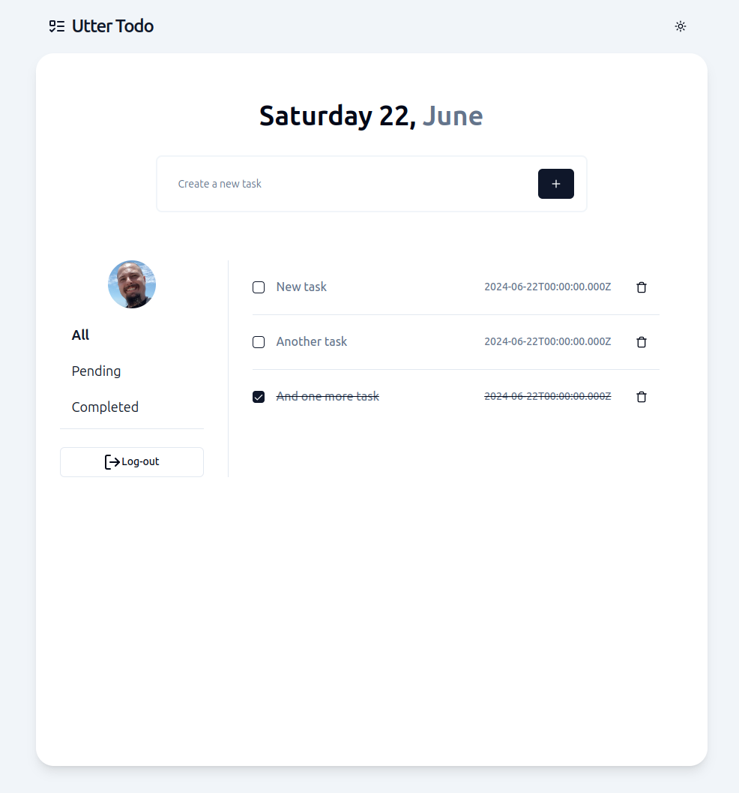

# Utter Todo
> From Nothing to an Automated CI/CD Deploying APP on AWS

1. **Project Setup and Organization**
   - [x] Set up a monorepo using Turborepo.
   - [x] Set up ./config workspaces (eslint, prettier and typescript).
   - [x] Set up a ./apps/web workspace with a create t3-app + shadcn/ui + vitest
   - [x] Set up a ./apps/api workspace with a new fastify api

2. **Domain - Business Logic**
   - [x] Define domain entities and value objects.
   - [x] Create use cases and unit tests for business logic.

3. **Frontend Development with Next.js**
   - [x] Develop frontend components and UI using Next.js and Shadcn/ui.
   - [x] Implement unit tests using Vitest for frontend components.
   - [x] Implement end-to-end tests with Playwright to validate frontend functionality.

4. **Backend Development with Nest.js**
   - [x] Implement backend APIs and business logic with Fastify.
   - [x] Implement end-to-end tests with vitest to validate all backend routes.

5. **Docker**
   - [x] Create a docker-compose.yml file for local development.
   - [x] Set up a Dockerfile for the Web and API workspaces.

6. **CI/CD Pipeline**
   - [x] Run all tests and build the application using GitHub Actions.
   - [x] Publish Docker images to Docker Hub and AWS ECR.
   - [x] Use semantic release to automate versioning and release management.
   - [x] Configure deployment to AWS App Runner for automated deployment.

7. **Infrastructure as Code (IaC) with Terraform**
   - [x] Define infrastructure requirements using Terraform.
   - [x] Provision AWS resources including ECR, App Runner, database, and Redis.

# Running locally

1. Run `pnpm install` to install dependencies on the root folder.
2. Run docker-compose up -d to start the database
3. Run `pnpm run dev` to start the application on port 3000 and api on port 4000.

